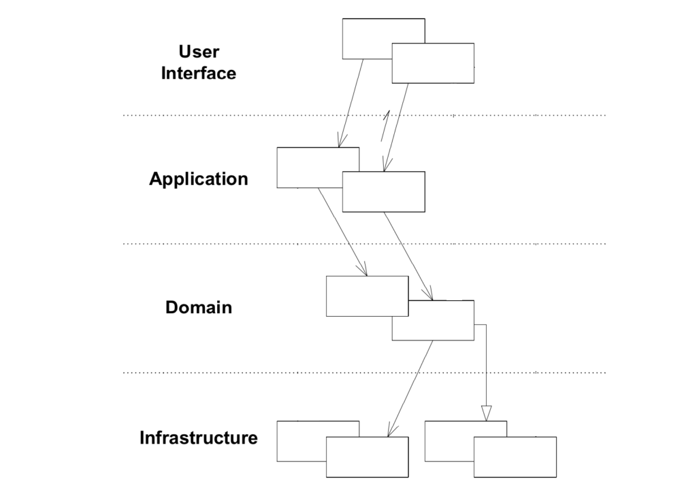

## Introduction
Le domaine driven design est une méthodologie de développement axé sur le métier.
Cette méthodologie est à utiliser quand les contraintes métier
### Force & faiblesse
#### Les Forces
- Application au plus proche des besoins des utilisateurs
- echanges facilité avec le dictionnaire en commun - facilite les échanges
- organisation standard et facilite l'intégration de nouveaux développeurs

#### Les faiblesses
- une parfaite maitrise du métier est requise
- apprentissage relativement longs des spécificités du métier

### Principes de bases
#### Dictionnaire en commun pour parler "la même lague"
Il est nécessaire d'employer les mêmes termes entre la technique et le métier. Sans quoi, il peut toujours y avoir une interprétation quelconque.
Un dictionnaire doit être créé afin de s'accorder avec le métier le langage métier.
Le but étant d'améliorer les communications avec les experts du métier et de comprendre au mieux ses complexités.

### Architecture logiciel
Il y a plusieurs types d'architecture logiciel dans le DDD mais le plus mis en avant selon est celui-ci: le layered architecture:

Les autres types sont expliqués dans cette vidéo: [Piochons dans les pratiques de DDD, programmation fonctionnelle and co pour notre bien à toutes et à tous !](https://www.youtube.com/watch?v=3zECd_9SP1A&t=86s)

Selon ce modèle, chaque intention utilisateur est schématiser par une `command` ou une `query`.
Puis, nous allons passer par chacune des couches pour récupérer les informations ou appliquer une action en conséquence.
- User Interface
  - point d'entrer de la commande, c'est ici que l'on va mettre des classes comme les controlleurs et les DTO
- Application
  - C'est ici que l'on va interpréter les informations données par l'utilisateur et créer une command ou une query
  - On va aussi créer un `CommandService` ou `QueryService` pour quesionner la couche inféreur le domaine
- Domain
  - C'est ici que le métier est décris. On y trouve les entités, enum, factory .... Tout ce qui touche et décrit le métier
  - On y met aussi les interfaces qui vont nous permettre de communiquer avec la couche `infrastructure`.
  - Ces interfaces sont requis car nous permettent de devenir indépendant des librairies que nous utilisons (ORM, REST service ...). Nous pouvons basculer de librairie sont que nous ayons à refactorer tout notre code. Une fois les interfaces définies, c'est aux librairies de retourner des objects en correspondance avec les interfaces.
- Infrastructure
  - C'est ici que l'on va faire appel aux couches basses comme:
    - base de données
    - appel à d'autres webservice
    - ...

### Références:
- https://www.softfluent.fr/blog/domain-driven-design-apport-microservices/
- https://lesdieuxducode.com/blog/2019/7/introduction-au-domain-driven-design